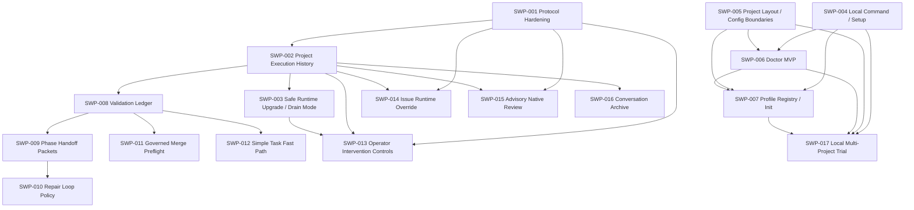

# Symphony Workflow Platform PRDs

Status: Draft roadmap

This is the canonical synthesis layer for the **Symphony Workflow Platform** PRD set.

The goal is to combine the app-server capability review, local adoption planning, and workflow-analysis findings into one implementable program. This README defines the source map, tracks, SWP IDs, dependency graph, and execution order before individual SWP PRDs are drafted.

## Authority

- `SPEC.md` remains the read-only upstream reference contract.
- `SPEC.ext.md` remains authoritative for current local extension behavior.
- `CONTEXT.md` is the glossary and decision record for this synthesis.
- Analysis documents are source material, not normative requirements.
- If analysis documents conflict with `CONTEXT.md`, the `CONTEXT.md` decision wins for final SWP drafting.

Final SWP PRDs live in this directory and use `SWP-###` IDs. Analysis-local PRDs under `docs/analysis/prd/` and `docs/workflow-analysis/prd/` keep their existing numbering and remain evidence/source material.

## Source Material

| Source | Role in synthesis |
| --- | --- |
| `docs/analysis/codex-app-server-capability-review.md` | App-server capability inventory, hardening plan, event-ledger ideas, operator controls, runtime override, native review, conversation archive. |
| `docs/analysis/codex-app-server-api-matrix.md` | Generated app-server API reference and current/adopt/defer posture. |
| `docs/workflow-analysis/recommendations.md` | Evidence-backed workflow-improvement ranking from recent ticket analysis. |
| `docs/workflow-analysis/prd/` | Draft PRDs for ticket ledger, validation ledger, handoff packets, repair policy, governed merge preflight, and fast path. |
| `docs/analysis/project-adoption-distribution-plan.md` | Local-first adoption strategy and distribution deferral. |
| `docs/analysis/prd/` | Draft PRDs for local command/setup, layout, profiles, init, doctor, customization, and multi-project trial. |
| `SPEC.md` | Base Symphony service behavior and app-server integration contract. |
| `SPEC.ext.md` | Current handoff/fresh-dispatch extension semantics. |
| `CONTEXT.md` | Canonical terminology and resolved decisions for this program. |

## Tracks

### Adopt Symphony

Make Symphony easy to use from local projects without weakening the internal Symphony workflow.

Includes local command setup, project layout boundaries, doctor, profile/init materialization, and the local multi-project trial.

### Understand Work

Make work auditable and restart-proof.

Includes project execution history, ticket-level orchestration history, app-server event summaries, token/effective-model facts, and later conversation archive.

### Improve Work

Use the durable evidence from Understand Work to make orchestration safer and cheaper.

Includes safe runtime upgrade/drain mode, validation reuse, handoff packets, repair-loop policy, governed merge preflight, simple-task fast path, operator controls, issue runtime overrides, and advisory native review.

## SWP Catalog

| SWP | Track | Title | Priority | Depends on | Can run in parallel with |
| --- | --- | --- | --- | --- | --- |
| `SWP-001` | Improve Work | Codex App Server Protocol Hardening | P0 | none | `SWP-004`, `SWP-005`, early `SWP-006` design |
| `SWP-002` | Understand Work | Project Execution History MVP | P0 | `SWP-001` | `SWP-004`, `SWP-005`, `SWP-006` |
| `SWP-003` | Improve Work | Safe Runtime Upgrade and Drain Mode | P0 | `SWP-002` | `SWP-004`, `SWP-005`, `SWP-006` |
| `SWP-004` | Adopt Symphony | Local Command and Setup | P1 | none | `SWP-001`, `SWP-002` |
| `SWP-005` | Adopt Symphony | Project Layout and Config Boundaries | P1 | none | `SWP-001`, `SWP-002` |
| `SWP-006` | Adopt Symphony | Doctor MVP | P1 | `SWP-004`, partly `SWP-005` | `SWP-001`, `SWP-002` |
| `SWP-007` | Adopt Symphony | Profile Registry and Init Materialization | P1 | `SWP-004`, `SWP-005`, partly `SWP-006` | `SWP-003`, `SWP-008` design |
| `SWP-008` | Improve Work | Validation Ledger | P1 | `SWP-002` | `SWP-007` |
| `SWP-009` | Improve Work | Phase Handoff Packets | P1 | `SWP-002`, `SWP-008` | `SWP-011` design |
| `SWP-010` | Improve Work | Repair Loop and Escalation Policy | P1 | `SWP-002`, `SWP-009` | `SWP-011` |
| `SWP-011` | Improve Work | Governed Submit and Merge Preflight | P1 | `SWP-002`, `SWP-008` | `SWP-010` |
| `SWP-012` | Improve Work | Simple Task Fast Path | P2 | `SWP-002`, `SWP-008` | `SWP-010`, `SWP-011` |
| `SWP-013` | Improve Work | Operator Intervention Controls | P2 | `SWP-001`, `SWP-002`, `SWP-003` | `SWP-014`, `SWP-015` design |
| `SWP-014` | Improve Work | Issue Runtime Override | P2 | `SWP-001`, `SWP-002` | `SWP-013`, `SWP-015` design |
| `SWP-015` | Improve Work | Advisory Native Review | P2 | `SWP-001`, `SWP-002`, `SPEC.ext.md` fresh-dispatch semantics | `SWP-013`, `SWP-014` |
| `SWP-016` | Understand Work | Conversation Archive | P2 | `SWP-002`, redaction/retention policy | later dashboard work |
| `SWP-017` | Adopt Symphony | Local Multi-Project Trial | P1 gate | `SWP-004`, `SWP-005`, `SWP-006`, `SWP-007` | Improve Work PRDs after `SWP-003` |

Priority means product priority inside this program, not strict serial order. Linear blockers should encode the actual implementation graph.

## Run Order Quick Reference

Use this order when creating and sequencing Linear work. Items in the same row can run in parallel once their listed blockers are satisfied.

| Run group | PRDs | Why this order |
| --- | --- | --- |
| 0. Draft parents | `SWP-001` through `SWP-017` parent PRDs | Establish stable parent issues and blockers before slicing into implementation work. |
| 1A. Runtime foundation | `SWP-001` -> `SWP-002` -> `SWP-003` | Harden protocol first, persist trustworthy history second, then add safe drain/restart. |
| 1B. Adoption foundation | `SWP-004`, `SWP-005` | These can run while `SWP-001` and `SWP-002` are underway. |
| 2A. Adoption MVP | `SWP-006` -> `SWP-007` -> `SWP-017` | Doctor and init depend on the command/layout work; trial validates adoption before distribution. |
| 2B. Evidence layer | `SWP-008` | Validation reuse needs `SWP-002` but can run independently of adoption once history exists. |
| 3A. Workflow reducers | `SWP-009`, `SWP-011`, then `SWP-010`, `SWP-012` | Handoff and merge preflight consume history/validation; repair policy and fast path consume those outputs. |
| 3B. Advanced controls | `SWP-013`, `SWP-014`, `SWP-015` | These require protocol/history foundations and should not block adoption. |
| 4. Privacy-heavy archive | `SWP-016` | Conversation storage waits until operational history, retention, and redaction policy are stable. |

Minimal first tranche:

1. `SWP-001`
2. `SWP-002`
3. `SWP-003`
4. `SWP-004`
5. `SWP-005`

This tranche gives Symphony safer app-server behavior, durable history, safe restart/drain, and the first local adoption foundation.

## Dependency Graph

## Execution Waves

### Wave 0: Drafting and Issue Setup

Create individual SWP PRDs from this README, then create Linear issues with blocker relationships that mirror the dependency graph.

Output:

- canonical SWP PRD files
- Linear issue list
- Linear blockers
- source-analysis supersession notes after canonical PRDs exist

### Wave 1: Early Foundations

Run these first:

1. `SWP-001` Codex App Server Protocol Hardening.
2. `SWP-002` Project Execution History MVP.
3. `SWP-003` Safe Runtime Upgrade and Drain Mode.

Parallel adoption work can start in the same wave:

- `SWP-004` Local Command and Setup.
- `SWP-005` Project Layout and Config Boundaries.

Rationale:

- Protocol hardening prevents unsafe or brittle app-server behavior from being persisted as history.
- Project Execution History gives restart-proof evidence and powers later Improve Work.
- Safe Runtime Upgrade addresses the operational pain of waiting manually for active agents before pulling and restarting.
- Local command/layout work is mostly independent and can progress while the runtime foundation is built.

### Wave 2: Adoption MVP

Run after `SWP-004` and `SWP-005` are underway:

1. `SWP-006` Doctor MVP.
2. `SWP-007` Profile Registry and Init Materialization.
3. `SWP-017` Local Multi-Project Trial, once `SWP-004` through `SWP-007` are complete enough to test.

Rationale:

- Doctor MVP should not wait for Project Execution History.
- Profile/init should use the project layout boundary and local command surface.
- The multi-project trial is an Adopt Symphony acceptance gate, not a blocker for all Improve Work PRDs.

### Wave 3: Evidence-Driven Workflow Improvements

Run after `SWP-002`:

1. `SWP-008` Validation Ledger.
2. `SWP-009` Phase Handoff Packets.
3. `SWP-011` Governed Submit and Merge Preflight.
4. `SWP-010` Repair Loop and Escalation Policy.
5. `SWP-012` Simple Task Fast Path.

Recommended order:

- `SWP-008` before `SWP-009`, `SWP-011`, and `SWP-012`.
- `SWP-009` before `SWP-010`.
- `SWP-011` can run after `SWP-008` without waiting for `SWP-010`.
- `SWP-012` should wait for advisory validation reuse from `SWP-008`.

### Wave 4: Advanced Runtime Capabilities

Run after the early foundations:

1. `SWP-013` Operator Intervention Controls.
2. `SWP-014` Issue Runtime Override.
3. `SWP-015` Advisory Native Review.
4. `SWP-016` Conversation Archive.

Rationale:

- `turn/steer` and other operator controls require active run/thread/turn projection, audit history, and drain/restart semantics.
- Issue Runtime Override requires policy validation and effective-model recording.
- Native review is advisory and must respect fresh-dispatch semantics.
- Conversation Archive is privacy-sensitive and should wait until operational history, redaction, and retention rules are stable.

## PRD Summaries

### SWP-001: Codex App Server Protocol Hardening

Purpose: make the existing Codex Runner integration safer and schema-aware before more features rely on app-server events.

Initial scope:

- Replace substring approval detection with an allowlisted server-request dispatcher.
- Remove generic `{ approved: true }` fallback for unknown approval-like requests.
- Return structured failures for unsupported dynamic tool calls and unsupported server requests.
- Treat unsupported permission/auth/account requests as operator-required or blocking failures.
- Add generated-contract tests for critical app-server shapes.
- Validate sandbox, approval, token, rate-limit, warning, and model-reroute shapes.
- Codify the Workspace Provisioning Boundary: Symphony owns Git worktree creation; app-server receives `cwd`.

Out of scope:

- Broad dynamic tool expansion.
- Plugin/app/marketplace APIs.
- Realtime APIs.
- App-server filesystem/process APIs.
- Replacing Symphony workspace provisioning with app-server conversation fork/resume APIs.

### SWP-002: Project Execution History MVP

Purpose: create restart-proof project/ticket/run history and the first history dashboard.

Initial scope:

- Project Identity based on project root plus workflow path, with workflow hash and repository remote stored as evidence.
- Ticket Identity based on tracker kind, tracker scope when available, stable issue id, and human identifier.
- Ticket Orchestration Ledger as the first view.
- Operational History persisted by default.
- App Server Event Ledger Lite with bounded summaries and typed high-value fields.
- Token and Effective Model facts persisted.
- Project History View with ticket table and ticket detail timeline.
- Project History Consumer Summary: compact read-only ticket/run facts for
  review automation and future workflow consumers.
- Retention knobs for operational and app-server-lite data.

Out of scope:

- Full conversation archive.
- Cost analytics beyond cost-ready token/effective-model fields.
- Validation reuse.
- Phase handoff packet generation.
- Drain mode decisions and operator steering.
- Cohort analytics dashboards.

### SWP-003: Safe Runtime Upgrade and Drain Mode

Purpose: let operators safely pull/restart/upgrade Symphony without manually waiting for active agents.

Initial scope:

- Drain Mode stops new dispatch immediately.
- Quiescence detection reports when no active worker, Codex process, tracker write, unflushed ledger write, or unpersisted retry state remains.
- API/dashboard status shows active blockers preventing restart.
- CLI/API controls for enter drain mode, check status, wait, and shutdown when quiescent.
- Default behavior waits for active runs to finish or hand off.
- Guided runtime update prepare/apply controls support an operator-approved fast-forward update after Drain Mode and quiescence checks pass.
- Guarded install/build runs only when package metadata or build scripts require it, and failures are surfaced as refused/failed update steps instead of hidden restart attempts.
- Supported supervisor-backed restart can request a managed dashboard restart after a successful guided update; deployments without supervisor support fall back to explicit manual restart guidance.
- Optional timeout can expose cancellation choices, but v1 should not force cancellation by default.

Out of scope:

- In-process Node module hot swap.
- Automatic update behavior that runs merely because a remote ref moved.
- In-process or background update without explicit operator prepare/apply initiation.
- Arbitrary local setup/package-manager automation beyond the guarded install/build needed for the prepared runtime update.
- Generic process-manager orchestration outside the supported Symphony supervisor restart path.
- Broader Local Command and Setup work from `SWP-004`.

### SWP-004: Local Command and Setup

Purpose: make the local checkout usable as a stable `symphony` command across projects.

Initial scope:

- Link local checkout once.
- `symphony dashboard` defaults to current project `WORKFLOW.md`.
- `symphony doctor`, `symphony setup`, `symphony --help`, and `symphony --version`.
- User-local high-trust consent outside project files.
- Existing npm scripts remain compatible.

### SWP-005: Project Layout and Config Boundaries

Purpose: separate committed workflow/customization from local runtime state.

Initial scope:

- Keep root `WORKFLOW.md` as the canonical runtime contract.
- Introduce `.symphony/system/` as the ignored runtime-owned state root.
- Reserve `.symphony/skills/` and `.symphony/prompts/` for later Project-Owned Customization.
- Doctor reports old/broad `.symphony/` ignores and migration guidance.

### SWP-006: Doctor MVP

Purpose: provide local readiness diagnostics before starting a long-running runtime.

Initial scope:

- Workflow existence/syntax/config validation.
- Required environment variable and tracker auth presence checks.
- Codex command availability.
- git/worktree safety.
- port availability.
- high-trust consent state.
- JSON and CI output.
- `doctor --fix` for safe local setup actions.

Out of scope:

- Doctor History Diagnostics, which depends on Project Execution History.

### SWP-007: Profile Registry and Init Materialization

Purpose: generate complete, reviewable `WORKFLOW.md` files for local projects.

Initial scope:

- Composable tracker/workspace/toolchain/workflow packs.
- Convenience bundles backed by explicit pack combinations.
- Safe `symphony init --dry-run`.
- File plan with conflict detection.
- Generate root `WORKFLOW.md`, `.env.example`, `.worktreeinclude` when needed, and `.gitignore` updates.
- Preserve `symphony-internal` as a protected golden profile.

Out of scope:

- Runtime profile inheritance.
- Project-owned skill/prompt loading.

### SWP-008: Validation Ledger

Purpose: record validation evidence in a reusable, auditable form.

Initial scope:

- Record command, cwd category, git tree hash, dependency lock hash, environment fingerprint, generated artifact hash, result, output summary, and evidence reference.
- Attach validation records to Project Execution History.
- Advisory Validation Reuse only: recommend/cite reuse, fail closed on missing or stale identity.
- API/dashboard summaries for ticket detail.

Out of scope:

- Silent automatic test skipping.

### SWP-009: Phase Handoff Packets

Purpose: reduce rediscovery between implementation, review, repair, and merge phases.

Initial scope:

- Symphony-owned packet schema, storage, drift checks, and rendering.
- Derived from Project Execution History, Validation Ledger, tracker state, PR state, branch head, and app-server summaries.
- Agent Handoff Notes can feed packets but do not replace the canonical packet.
- Partial stale/valid section handling.

### SWP-010: Repair Loop and Escalation Policy

Purpose: make repeated phase loops visible and bounded without blocking legitimate work by default.

Initial scope:

- Policy outcomes: continue, narrow repair, escalate, block.
- Soft escalation by default.
- Hard block only if workflow config explicitly enables it.
- Repair events include source phase, target phase, blocker category, expected changed scope, validation scope, evidence reference, and actor.

### SWP-011: Governed Submit and Merge Preflight

Purpose: replace repeated merge/PR shell probing with structured readiness data.

Initial scope:

- Symphony-owned tooling/API surface with stable JSON.
- Check git config writability, branch tracking, PR identity, PR body source, labels, checks, mergeability, validation state, and evidence.
- Skills call this surface but do not own its behavior.
- Project Execution History records preflight results.

### SWP-012: Simple Task Fast Path

Purpose: reduce cost for narrow tasks while failing closed on uncertainty.

Initial scope:

- Classify docs-only, style-only, UI-visible style, test-only, metadata-only, low-risk code, and full-workflow-required changes.
- Record decision, confidence, validation scope, and escalation checks in history.
- Use Advisory Validation Reuse.
- UI-visible fast-path tasks still satisfy UI evidence and Human Review requirements.

### SWP-013: Operator Intervention Controls

Purpose: support audited operator action against active runs.

Initial scope:

- Prototype `turn/steer` with active thread/turn requirement.
- Require `expectedTurnId`.
- Require operator reason.
- Fail closed on stale turn.
- Record operator action in Project Execution History and App Server Event Ledger Lite.
- Do not use steer for blocked-input submission in v1.

### SWP-014: Issue Runtime Override

Purpose: let workflow policy choose model/effort based on ticket labels or other controlled metadata.

Initial scope:

- Label/policy based first version.
- Allowlisted model and reasoning-effort values.
- Invalid overrides fall back by default.
- Optional strict mode can block dispatch.
- Requested model and Effective Model recorded in Project Execution History.
- `model/rerouted` updates Effective Model.

Out of scope:

- Free-form issue text as runtime settings.

### SWP-015: Advisory Native Review

Purpose: add Codex App Server native review as an advisory Agent Review sub-step.

Initial scope:

- Optional, workflow-gated invocation of `review/start`.
- Agent Review still interprets findings and routes tracker state.
- Native review never directly changes tracker state.
- Must respect Fresh Dispatch State semantics.
- Must not bypass Human Review for UI-visible changes.

### SWP-016: Conversation Archive

Purpose: enable later conversation-level audit and workflow improvement without making raw transcripts part of the history MVP.

Initial scope:

- Redacted conversation archive tier.
- Opt-in unredacted local-only tier.
- Retention controls.
- Export exclusions by default for unredacted data.
- Dashboard/API access after privacy posture is explicit.

### SWP-017: Local Multi-Project Trial

Purpose: prove local adoption before public distribution work.

Initial scope:

- Trial against Symphony itself.
- Trial against an existing external local project with `WORKFLOW.md`.
- Trial against a new Node project.
- Trial against a new generic/non-Node project.
- Exercise local command, doctor, init, profile materialization, dashboard startup where safe, high-trust consent, and `.symphony/system/` layout.

Out of scope:

- npm distribution.
- Homebrew.
- standalone binary.
- desktop packaging.

## Cross-Cutting Rules

### Dashboard/API Ownership

Do not create a separate dashboard mega-PRD. Each feature PRD owns the minimal Dashboard Evidence Surface it needs. This README coordinates consistency across surfaces.

### Privacy and Retention

- Operational History persists by default.
- App Server Event Ledger Lite persists bounded summaries and typed fields by default.
- Full raw app-server payloads are not persisted by default.
- Conversation Archive is a later privacy-sensitive PRD.
- Unredacted Conversation Archive is opt-in, local-only, retention-limited, and excluded from exports by default.

### Cost and Token Analytics

`SWP-002` persists token and Effective Model facts. Cost analytics are deferred until pricing snapshot/version/confidence semantics are defined.

### Workspace Boundary

Symphony Workspace Manager owns filesystem workspace and Git worktree creation. Codex App Server receives the provisioned `cwd`. `thread/fork` and `thread/resume` are conversation/session controls, not native Git worktree provisioning.

### Adoption Boundary

Local-first adoption is the near-term target. npm, Homebrew, standalone binary, and desktop distribution remain deferred until `SWP-017` passes.

### Source Supersession

After canonical SWP PRDs are drafted, add supersession notes to the analysis README files pointing readers to this directory. Do not delete analysis documents; they remain evidence.

## Linear Blocker Guidance

When turning SWP PRDs into Linear issues:

- Create one Linear issue per SWP PRD first.
- Add blockers matching the dependency graph, not the numeric order.
- Use SWP IDs in issue titles.
- Break each SWP PRD into smaller implementation issues only after the parent PRD is reviewed.
- Allow independent tracks to run in parallel when their blockers are satisfied.
- Keep `SWP-003` visible as an early priority because it removes the operational pain of manually timing server restarts around active agents.

Suggested first Linear parent issues:

1. `SWP-001 Codex App Server Protocol Hardening`
2. `SWP-002 Project Execution History MVP`
3. `SWP-003 Safe Runtime Upgrade and Drain Mode`
4. `SWP-004 Local Command and Setup`
5. `SWP-005 Project Layout and Config Boundaries`

Suggested first blocker edges:

- `SWP-002` blocked by `SWP-001`
- `SWP-003` blocked by `SWP-002`
- `SWP-006` blocked by `SWP-004` and partially by `SWP-005`
- `SWP-007` blocked by `SWP-004`, `SWP-005`, and partially by `SWP-006`
- `SWP-017` blocked by `SWP-004`, `SWP-005`, `SWP-006`, and `SWP-007`
- `SWP-008` blocked by `SWP-002`
- `SWP-009` blocked by `SWP-002` and `SWP-008`
- `SWP-010` blocked by `SWP-002` and `SWP-009`
- `SWP-011` blocked by `SWP-002` and `SWP-008`
- `SWP-012` blocked by `SWP-002` and `SWP-008`
- `SWP-013` blocked by `SWP-001`, `SWP-002`, and `SWP-003`
- `SWP-014` blocked by `SWP-001` and `SWP-002`
- `SWP-015` blocked by `SWP-001` and `SWP-002`
- `SWP-016` blocked by `SWP-002`
